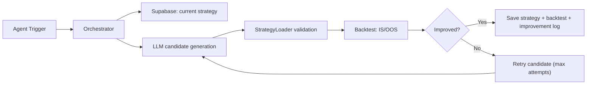

# TRINITY-CHIMERY

페르소나 기반 멀티 에이전트 트레이딩 실험 플랫폼입니다.  
각 에이전트가 전략을 생성/개선하고, 백테스트 결과를 기준으로 진화를 반복하도록 설계되어 있습니다.


## Overview

이 프로젝트는 아래 흐름을 하나의 루프로 묶습니다.

1. 에이전트별 현재 전략 로드
2. OOS 중심 성과 지표 수집
3. LLM 기반 후보 전략 생성
4. IS/OOS 검증 및 게이트 통과 여부 판정
5. 개선 전략 저장 + 로그 기록

핵심 목표는 단순 수익률이 아니라, OOS 품질을 반영한 안정적인 전략 개선입니다.

## Current Defaults

현재 코드 기준 기본 운영값입니다.

- `EVOLUTION_CANDIDATE_ATTEMPTS=5` (후보 생성 최대 5회)
- `EVOLUTION_CYCLE_MAX_CONCURRENCY=1` (LLM 진화 사이클 순차 처리)
- `EVOLUTION_LLM_GENERATION_TIMEOUT_SECONDS=90`
- `EVOLUTION_LLM_REQUEST_RETRIES=2`

## Architecture



## Repository Layout

```text
trinity-chimery/
server/
├── modules/
│   ├── chat/        <-- [Chat] 대화형 전략 생성 로직 (Router, Handler)
│   ├── engine/      <-- [Core] 백테스트 실행 및 전략 관리 (BacktestEngine)
│   ├── evolution/   <-- [Loop] 에이전트 자동 진화 오케스트레이션
│   └── backtest/    <-- [Engine] 신규 고성능 백테스트 네이티브 엔진
│
├── shared/          <-- [Shared] LLM 클라이언트, DB(Supabase) 유틸리티
│
└── api/
    └── main.py      <-- [Entry] FastAPI 앱 설정 및 라우터 통합
```

## Quick Start

### 1) Prerequisites

- Python 3.9+
- Node.js 20+
- `npm`

### 2) Install

```bash
git clone https://github.com/leeluse/trinity-chimery.git
cd trinity-chimery

pip install -r requirements.txt
cd client && npm install
cd ..
```

### 3) Environment

루트 `.env`에 최소 아래 키가 필요합니다.

- `SUPABASE_URL`
- `SUPABASE_KEY`
- `LLM_PROVIDER`
- `OPENAI_BASE_URL`
- `OPENAI_API_KEY`
- `OPENAI_MODEL`

선택(운영 튜닝):

- `EVOLUTION_CANDIDATE_ATTEMPTS`
- `EVOLUTION_CYCLE_MAX_CONCURRENCY`
- `EVOLUTION_LLM_GENERATION_TIMEOUT_SECONDS`
- `EVOLUTION_POLL_MINUTES`

### 4) Run

권장 실행:

```bash
./run server   # FastAPI (8000)
./run client   # Next.js (3000)
```

테스트:

```bash
./run test
```

수동 실행:

```bash
# backend
cd server/api
source ../../venv/bin/activate
PYTHONPATH=../.. python -m server.api.main

# frontend
cd ../../client
npm run dev
```

## Main API Surface

주요 엔드포인트만 요약했습니다.

- `POST /api/agents/run-loop` : 다중 에이전트 진화 루구 실행
- `POST /api/agents/{agent_id}/evolve` : 단일 에이전트 진화 실행
- `GET /api/backtest/run` : 정석 백테스트 실행 (Manual)
- `GET /api/backtest/strategies` : 사용 가능한 전략 목록
- `POST /api/chat/run` : 4단계 대화형 전략 생성 (Streaming)
- `POST /api/chat/backtest` : 채팅 내 생성 전략 독립 검증
- `GET /api/chat/history` : 대화 기록 조회

## Frontend Notes

- 우측 패널 탭은 `LOGS | EVOLUTION | BACKTEST` 기반으로 동작합니다.
- 로그 패널은 에이전트별 컬러와 한국어 상태 문구를 사용합니다.
- `/?view=evolution`, `/?view=logs` 쿼리로 뷰를 명시적으로 전환합니다.

## Troubleshooting

### LOGS/EVOLUTION 전환이 안 되는 경우

1. 배포 버전이 최신인지 확인
2. 강력 새로고침 (`Cmd+Shift+R`)
3. `/?view=evolution`에서 `LOGS` 클릭 시 `/?view=logs`로 바뀌는지 확인

### 로그가 갱신되지 않는 경우

- 브라우저 캐시가 남아 있을 수 있습니다.
- 현재 API는 `no-store` 기준으로 응답하도록 되어 있으니, 서버 재시작 후 재확인하세요.

### LLM 요청이 자주 실패하는 경우

- `EVOLUTION_CYCLE_MAX_CONCURRENCY=1` 유지
- `EVOLUTION_CANDIDATE_ATTEMPTS`, `EVOLUTION_LLM_GENERATION_TIMEOUT_SECONDS` 조정
- 업스트림 모델 서버 상태(`OPENAI_BASE_URL`) 확인

## Docs

- [LLM Docs](docs/llm/README.md)
- [Server Structure](docs/server-structure.md)
- [Project Specification](PROJECT.md)
- [Internal Manual](MENUAL.md)

## Contact

- Issue Tracker: GitHub Issues
- Email: project@trinity-chimery.com
