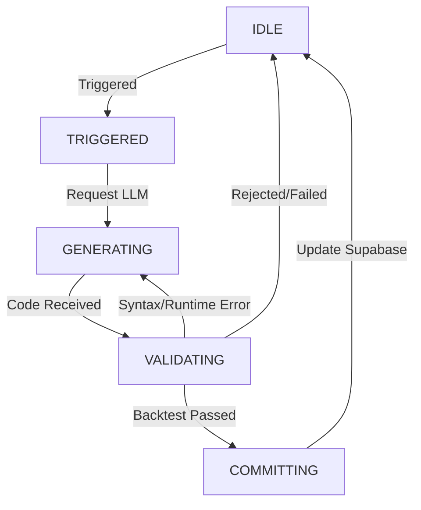

# [설계 문서] Trinity AI Trading System: 자율 진화 오케스트레이터 (Autonomous Evolution Orchestrator)

## 1. 개요
본 설계는 LLM 에이전트가 시장 환경과 자신의 성과, 그리고 경쟁자의 상태를 분석하여 스스로 전략 코드를 개선하고 반영하는 **자율 진화 루프**의 핵심 오케스트레이션을 정의합니다.

- **핵심 목표**: 시장 변화에 대한 적응형 대응, 성과 기반의 전략적 피벗, 그리고 안정적인 코드 생성을 통한 자율 진화 시스템 구축.
- **핵심 메커니즘**: 적응형 트리거 $\rightarrow$ 요약형 컨텍스트 피드백 $\rightarrow$ 자가 수정 루프 $\rightarrow$ 성과 기반 커밋.

---

## 2. 자율 진화 상태 머신 (Evolution State Machine)

오케스트레이터는 각 에이전트별로 다음과 같은 상태 전이를 관리합니다.

### 상태별 상세 동작
1. **TRIGGERED**: 진화 조건 충족. 현재 전략, 최근 성과, 시장 맥락을 수집하여 '진화 패키지' 구성.
2. **GENERATING**: LLM에게 진화 패키지를 전달하고 새 전략 코드를 요청.
   - **Self-Correction**: 생성된 코드에 에러가 있을 경우, 에러 로그를 포함해 최대 3회까지 재요청.
3. **VALIDATING**: `StrategyLoader`를 통해 코드를 로드하고 `BacktestManager`로 IS/OOS 검증 수행.
   - **Validation Gate**: OOS 성과가 IS 성과의 70% 이상이어야 하며, Trinity Score가 개선되어야 함.
4. **COMMITTING**: 검증된 전략을 Supabase의 `strategies` 테이블에 새 버전으로 저장하고, `agents` 테이블의 `current_strategy_id`를 업데이트.

---

## 3. 적응형 트리거 시스템 (Adaptive Trigger System)

단일 주기가 아닌, 다층적 트리거를 통해 진화 시점을 결정합니다.

| 트리거 레벨 | 명칭 | 조건 | 대상 | 진화 강도 (Intensity) |
| :--- | :--- | :--- | :--- | :--- |
| **L1** | **Regime-Shift** | HMM 기반 시장 국면 변경 시 | 전체 에이전트 | **High (Pivot)**: 국면 변화에 맞는 전략 전면 재검토 |
| **L2** | **Performance Decay** | 실시간 Trinity Score $\le$ 과거 평균의 80% | 해당 에이전트 | **High (Pivot)**: 현재 접근 방식의 실패 인정 및 수정 |
| **L3** | **Competitive Pressure** | 상위 에이전트와의 성과 격차 $\ge$ 임계치 | 하위 그룹 | **Medium (Optimize)**: 경쟁 우위 요소 분석 및 반영 |
| **L4** | **Heartbeat** | 14일 주기 도래 | 전체 에이전트 | **Low (Tuning)**: 최신 데이터 기반 파라미터 미세 조정 |

---

## 4. LLM 피드백 루프: 핵심 요약형 C-mode

LLM의 주의력 분산을 막고 효율을 극대화하기 위해 데이터를 요약하여 제공합니다.

### 제공 컨텍스트 구성
1. **현재 전략**: 생성된 Python 코드 및 주요 하이퍼파라미터.
2. **성과 리포트**:
   - **핵심 지표**: 현재 Trinity Score, Return, Sharpe, MDD.
   - **취약점 분석**: 가장 큰 손실이 발생한 기간 및 해당 구간의 시장 상황 로그.
3. **진화 맥락**:
   - **이력 요약**: 버전별 Trinity Score 추이 (텍스트 그래프) 및 주요 실패/성공 원인 요약.
   - **상대적 위치**: 전체 에이전트 중 현재 순위 및 평균 성과 대비 격차.
4. **외부 벤치마크**: 현재 1위 에이전트의 전략적 특성(예: "강한 추세 추종 성향") 요약.
5. **시장 환경**: 현재 Market Regime (Bull/Bear/Sideways) 및 주요 변동성 지표.

---

## 5. 기술적 구현 상세

### 5.1 오케스트레이터 구조
- **`EvolutionOrchestrator`**: `APScheduler`를 사용하여 에이전트별 작업을 예약하고 상태를 관리하는 메인 클래스.
- **`LLMClient`**: 진화 패키지를 프롬프트로 변환하고, Self-Correction 루프를 관리하는 인터페이스.
- **`SupabaseManager`**: 전략 버전 관리 및 성과 이력 저장.

### 5.2 안전 장치 (Guardrails)
- **실행 격리**: `StrategyLoader`의 `multiprocessing` 타임아웃(30초)을 통한 무한 루프 방지.
- **정적 분석**: `ast` 기반 금지 모듈/함수 차단을 통한 보안 유지.
- **과적합 방지**: `BacktestManager`의 IS/OOS Splitter 및 70% Validation Gate 강제 적용.

---

## 6. API 및 프론트엔드 연동
- **트리거 엔드포인트**: `/api/agents/{id}/evolve` 호출 시 강제로 `TRIGGERED` 상태로 전이.
- **상태 모니터링**: `/api/agents/{id}/status`를 통해 현재 `GENERATING` $\rightarrow$ `VALIDATING` 등의 진행 상황 실시간 반환.
- **Realtime 반영**: Supabase Realtime을 통해 전략 업데이트 즉시 대시보드 갱신.
