# Architecture Overview — Trinity Chimera

> **Last Updated**: 2026-05-11

---

## 1. 시스템 구성

Trinity Chimera는 **LLM 기반 트레이딩 전략 연구 플랫폼**입니다.

```mermaid
graph LR
    subgraph Client ["Frontend (Next.js 15, App Router)"]
        P1[Overview Dashboard]
        P2[Chat Interface]
        P3[Backtest Page]
        P4[Terminal Hunter V16]
    end

    subgraph Backend ["Backend (FastAPI, Python)"]
        R1["/api/chat — ChatHandler"]
        R2["/api/backtest — Engine Router"]
        R3["/api/system — Settings"]
        R4["/api/bots — Bot Manager"]
        R5["/api/agents — Evolution"]
    end

    subgraph Shared ["Shared Services"]
        S1["shared/llm/client.py (LLM 추론)"]
        S2["shared/db/supabase.py (DB)"]
        S3["shared/market/ (시장 데이터)"]
    end

    subgraph Infra ["Infrastructure"]
        I1["Supabase (PostgreSQL + Auth)"]
        I2["LLM Provider (Ollama / Claude / Qwen)"]
        I3["Binance Futures WebSocket"]
    end

    Client -->|REST / SSE| Backend
    Backend --> Shared
    Shared --> Infra
```



---

## 2. 디렉터리 구조

```
trinity-chimery/
├── client/                        # Next.js 프론트엔드
│   ├── app/
│   │   ├── page.tsx               # / → Overview 리다이렉트
│   │   ├── backtest/              # 백테스트 페이지
│   │   ├── terminal/              # Alpha Hunter 터미널
│   │   └── api/[...path]/         # Next.js proxy → FastAPI :8000
│   └── components/features/
│       ├── chat/                  # 채팅 UI
│       ├── backtest/              # 백테스트 UI
│       ├── dashboard/             # Overview 대시보드
│       └── terminal/              # Hunter Panel (hunterRuntime.ts)
│
├── server/                        # FastAPI 백엔드
│   ├── api/main.py                # 앱 진입점, 라우터 등록
│   ├── modules/
│   │   ├── chat/                  # 채팅 파이프라인
│   │   │   ├── handler.py         # 인텐트 분류 + 디스패치
│   │   │   ├── router.py          # /api/chat 엔드포인트
│   │   │   └── skills/            # 파이프라인 스킬들
│   │   ├── engine/                # 백테스트 엔진 API
│   │   ├── bots/                  # 봇 시뮬레이션 관리
│   │   └── settings/              # LLM 설정 API
│   ├── shared/
│   │   ├── llm/client.py          # LLM 단일 진입점
│   │   ├── db/supabase.py         # DB 클라이언트
│   │   └── market/                # 시장 데이터 공급자
│   └── strategies/                # 전략 라이브러리 (.py)
│
└── wiki/obsidian/                 # 프로젝트 문서
```

---

## 3. API 전체 목록

### Chat

| Method | Path | 설명 |
|---|---|---|
| POST | `/api/chat/run` | 채팅 파이프라인 (SSE) |
| GET | `/api/chat/history` | 채팅 내역 |
| DELETE | `/api/chat/history` | 세션 삭제 |
| GET | `/api/chat/sessions` | 세션 목록 |
| POST | `/api/chat/backtest` | 즉시 백테스트 |
| POST | `/api/chat/deploy` | 전략 배포 |

### Backtest Engine

| Method | Path | 설명 |
|---|---|---|
| GET | `/api/backtest/run` | 백테스트 실행 |
| GET | `/api/backtest/strategies` | 전략 목록 |
| GET | `/api/backtest/strategies/{key}/code` | 전략 코드 조회 |
| POST | `/api/backtest/leaderboard` | 전략 리더보드 |
| POST | `/api/backtest/optimize` | 파라미터 최적화 |
| GET | `/api/backtest/market/ohlcv` | OHLCV 시장 데이터 |
| POST | `/api/backtest/llm/backtest-analysis` | LLM 분석 리포트 |

### System / Bots / Agents

| Method | Path | 설명 |
|---|---|---|
| GET/POST | `/api/system/settings` | LLM 모델 설정 |
| GET/POST/DELETE | `/api/bots/...` | 봇 CRUD + 트레이드 |
| GET/POST | `/api/agents/...` | Evolution 에이전트 |

---

## 4. 주요 기술 스택

| 레이어 | 기술 |
|---|---|
| Frontend | Next.js 15, React, Tailwind CSS v4, Zustand |
| Backend | FastAPI, Python 3.12+, APScheduler |
| LLM 추론 | Ollama / LiteLLM (OpenAI-compatible) |
| DB | Supabase (PostgreSQL) |
| 실시간 데이터 | Binance/OKX/Bybit/Bitget WebSocket |
| 백테스트 | pandas, numpy (커스텀 엔진) |
