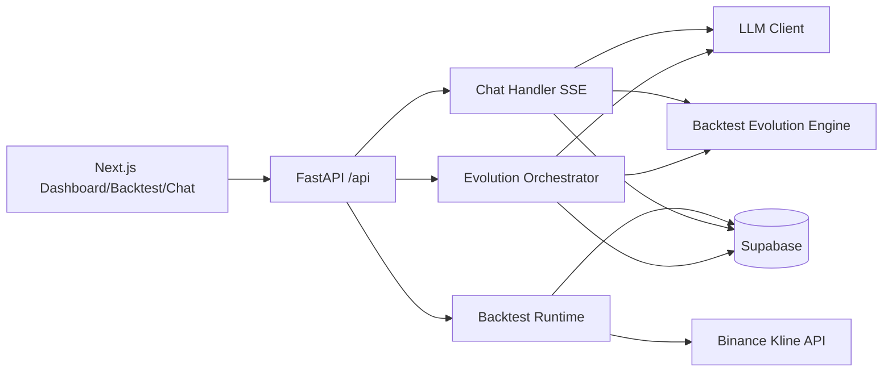

# System Architecture

## 계층
- Presentation: `client/*`
- API Layer: `server/api/main.py`, `server/modules/*/router.py`
- Domain Layer: `server/modules/evolution|chat|backtest|engine/*`
- Shared Infra: `server/shared/db|llm|market/*`

## 스케줄러
- `APScheduler`가 startup 시 `evolution_poll` 등록
- 기본 상태 `paused`
- `/api/system/automation`으로 resume/pause 제어
