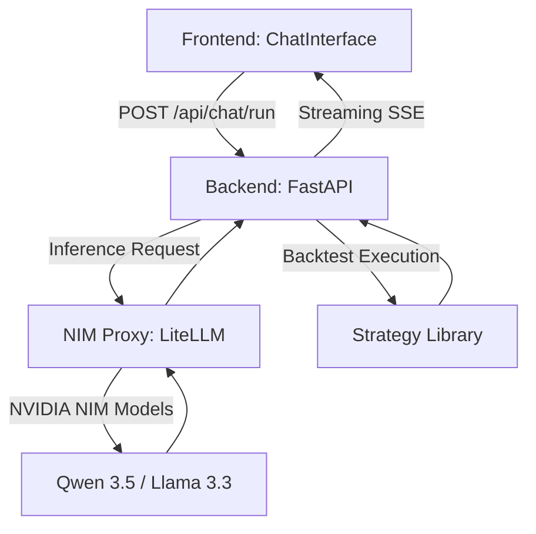

이 문서는 Trinity Chimera 시스템의 핵심인 AI 채팅 및 전략 발굴 파이프라인의 구조와 흐름을 정리합니다.

## 1. 아키텍처 개요

전체 파이프라인은 **Frontend (Next.js)**, **Backend (FastAPI)**, 그리고 **NIM Proxy (Model Orchestrator)**의 3계층 구조로 이루어져 있습니다.



---

## 2. 상세 파이프라인 흐름

### 단계 1: 요청 및 컨텍스트 구성 (Frontend)
- 유저가 채팅 입력 시 `ChatInterface.tsx`에서 요청을 시작합니다.
- `session_id`, `history`, `context` (현재 활성 에이전트 정보 등)를 포함한 JSON 데이터를 백엔드로 전송합니다.
- 브라우저의 `fetch` API와 `ReadableStream`을 사용하여 백엔드에서 실시간으로 내려주는 SSE(Server-Sent Events)를 구독합니다.

### 단계 2: 에볼루션 루프 (Backend)
백엔드는 총 5단계의 전략 진화 스테이지를 거칩니다:
1.  **Status**: 파이프라인 상태 알림 (진행 중...)
2.  **Thought**: 모델의 추론 과정 (`<thought>` 태그 내 스트리밍)
3.  **Strategy**: 발굴된 전략의 제목과 요약 설명 생성
4.  **Backtest**: 전략 코드를 샌드박스에서 실행하여 수익률, MDD 등 지표 추출
5.  **Analysis**: 최종 결과에 대한 모델의 코멘트 및 인사이트 제공

### 단계 3: 실시간 스트리밍 처리 (Frontend)
`ChatInterface`는 수신된 SSE 이벤트를 타입별로 분기 처리하여 UI를 실시간 업데이트합니다:
- `stage`: 현재 진행 퍼센트 및 스테이지 표시 업데이트
- `thought`: 아코디언 메뉴 내에 실시간 추론 텍스트 누적
- `backtest`: 성공 시 결과 카드를 렌더링하고, 발굴된 코드를 에디터에 자동 반영 (onApplyCode)

---

## 3. 핵심 기술 스택 및 최적화

| 관련 컴포넌트 | 기술 / 라이브러리 | 용도 |
| :--- | :--- | :--- |
| **Frontend** | React, Tailwind, Zustand | UI 구성 및 모달 전역 상태 관리 |
| **Streaming** | Fetch Body Reader (SSE) | 끊김 없는 실시간 데이터 전달 및 UX 향상 |
| **Markdown** | React-Markdown, Remark-Gfm | AI의 응답 및 표(Table) 시각화 |
| **Performance** | React.memo, useMemo | 채팅 입력 시 렉(Lag) 방지 및 렌더링 최적화 |
| **Infrastructure** | NVIDIA NIM, LiteLLM | 멀티 모델 오케스트레이션 및 고속 추론 |

## 4. 데이터 스키마 (SSE Event)

```json
{
  "type": "stage",
  "stage": 1,
  "label": "전략 로직 수립 중"
}
```

```json
{
  "type": "backtest",
  "data": {
    "ret": "12.5%",
    "mdd": "-2.1%",
    "winRate": "65%",
    "sharpe": "2.1",
    "trades": "42",
    "pf": "1.8"
  },
  "strategy_code": "def strategy()...",
  "payload": { ... }
}
```

---

## 5. 프롬프트 품질 개선 (2026-04-20)

### YAML 설계 청사진
Stage 2 설계 단계가 마크다운 표에서 YAML 블록으로 교체됨. 토큰 절감 ~220 tokens.

```yaml
strategy: {name, type, hypothesis, best_market}
signal: {tier1_trend, tier2_entry, tier3_filter}
regime_filter: {condition, no_trade_when}
entry_exit: {long: {entry, exit}, short: {entry, exit}}
adaptive_thresholds: [{var, formula}]
risk_profile: {trade_freq, sharpe_estimate, fail_condition}
```

### `<think>` 의사코드 강제 (Stage 3)
코드 작성 전 `<think>` 블록에서 지표 의사코드→조건식→AND 개수 체크→빈도 예상을 LLM 스스로 검토.
AND 조건 3개 초과 시 자체 수정 규칙 포함.

### Self-Critique (Evolution 전용)
Evolution `_self_critique()` — Q1 숏신호/Q2 AND 과적층/Q3 미정의 변수를 temperature=0.1로 검사.
실패 시 재생성, `max_retries` 소진 시 마지막 코드 반환.

---

## 6. 전략 코드 생성 규격 (2026-04-17 통일)

채팅 파이프라인의 코드 생성은 **진화 파이프라인과 동일한 함수 시그니처**를 사용한다.

### 요구 시그니처
```python
def generate_signal(train_df: pd.DataFrame, test_df: pd.DataFrame) -> pd.Series:
```
- `train_df` / `test_df`: DatetimeIndex, 컬럼 = `open` / `high` / `low` / `close` / `volume`
- 반환: `test_df.index`와 동일한 인덱스의 `pd.Series` (1=롱, -1=숏, 0=관망)
- 허용 라이브러리: `numpy as np`, `pandas as pd` **만** 사용 가능 (ta, talib, scipy 금지)

### 거래 수 최소 요건
- 전체 테스트 구간에서 **20건 이상** 신호가 발생해야 채택 가능
- 진입 조건이 지나치게 엄격하면 0건 → 즉시 폐기

### 지표 구현 레시피
```python
# EMA
ema = close.ewm(span=n, adjust=False).mean()
# RSI
d = close.diff()
rsi = 100 - 100 / (1 + d.clip(lower=0).rolling(14).mean() /
                   (-d.clip(upper=0).rolling(14).mean()).replace(0, 1e-9))
# Bollinger Bands
sma = close.rolling(20).mean(); std = close.rolling(20).std()
upper_bb = sma + 2*std; lower_bb = sma - 2*std
# ATR
tr = pd.concat([(high-low), (high-close.shift()).abs(), (low-close.shift()).abs()], axis=1).max(axis=1)
atr = tr.ewm(span=14, adjust=False).mean()
# MACD
macd = close.ewm(span=12,adjust=False).mean() - close.ewm(span=26,adjust=False).mean()
sig_line = macd.ewm(span=9,adjust=False).mean()
```

→ 프롬프트 상세는 `server/modules/chat/prompts.py` > `CODE_PROMPT_TEMPLATE` 참고

---

> [!TIP]
> **성능 최적화 팁**: 현재 `useMemo`를 통해 `renderedMessages`를 최적화하여 긴 대화 세션에서도 채팅 입력이 Snappy하게 유지되도록 설계되었습니다.
