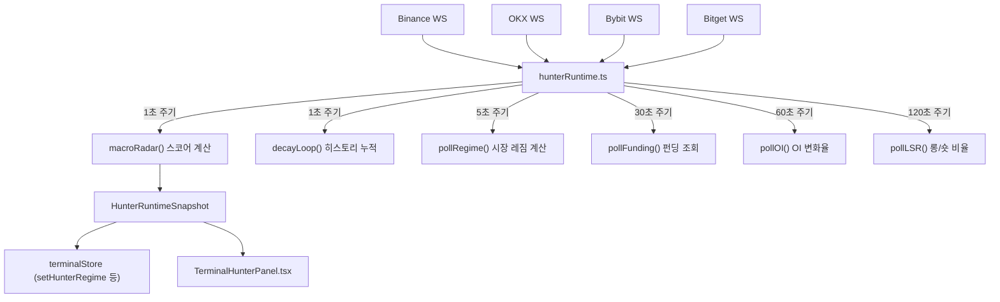

# Terminal — Alpha Hunter V16

> **Last Updated**: 2026-05-11

---

## 1. 개요

Alpha Hunter V16은 **멀티 거래소 실시간 WebSocket 신호 수집 + Stage-Gate 필터링 + 리더보드** 기능을 제공하는 터미널 대시보드입니다.

- 경로: `client/components/features/terminal/`
- 메인 엔진: `hunterRuntime.ts` (브라우저 런타임, 서버 의존 없음)
- 상태 관리: `terminalStore.ts` (Zustand)

---

## 2. 지원 거래소 WebSocket

| 거래소 | 데이터 |
|---|---|
| Binance Futures | 스냅샷 WebSocket + Sniper 전용 스트림 |
| OKX | 체결 데이터 |
| Bybit | 체결 데이터 |
| Bitget | 체결 데이터 |

---

## 3. 핵심 데이터 흐름

---

## 4. Stage-Gate 시스템

각 자산에 누적 점수(score)를 계산하고 Stage로 분류합니다.

| Stage | 의미 | 조건 |
|---|---|---|
| S0 | 관망 | 신호 없음 |
| S1 | 대기 | 셋업 신호 감지 |
| S2 | 진입 | 트리거 신호 충족 |
| S3 | 확신 | A-Grade 추가 확인 |

---

## 5. 시장 레짐 지표 (`HunterRegime`)

`pollRegime()`이 5초 간격으로 수집합니다.

| 지표 | 계산 방식 |
|---|---|
| `btcAltDelta` | BTC 5분 추세 대비 알트 평균 추세 차이 |
| `avgFunding` | 전체 심볼 펀딩비 평균 |
| `oiExpansionRate` | OI 변화율 평균 |
| `longFlowRatio` | LSR 롱 비율 평균 (0~100%) |

---

## 6. Zustand Store (`terminalStore.ts`) 주요 상태

| 상태 | 타입 | 역할 |
|---|---|---|
| `hunterRows` | `HunterRow[]` | 실시간 스나이퍼 목록 |
| `hunterLeaderboard` | `HunterLeaderboardItem[]` | 30분 누적 리더보드 |
| `hunterRegime` | `HunterRegime` | 시장 레짐 지표 |
| `hunterSummary` | `HunterSummary` | 요약 통계 |
| `hunterAlert` | `HunterAlert \| null` | S2+ 신규 진입 알림 |
| `selectedSymbol` | `string \| null` | 선택된 심볼 |

---

## 7. UI 탭 구성

| 탭 | 내용 |
|---|---|
| 실시간 시그널 | Stage-Gate 스나이퍼 행, Crime 신호, 강도 바 |
| 시장 상황 | HunterRegime 4개 지표 + 30분 리더보드 |
