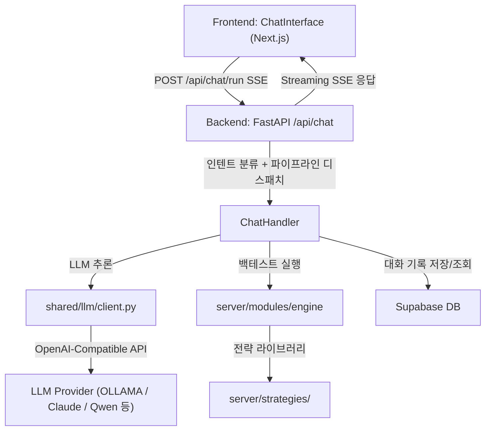
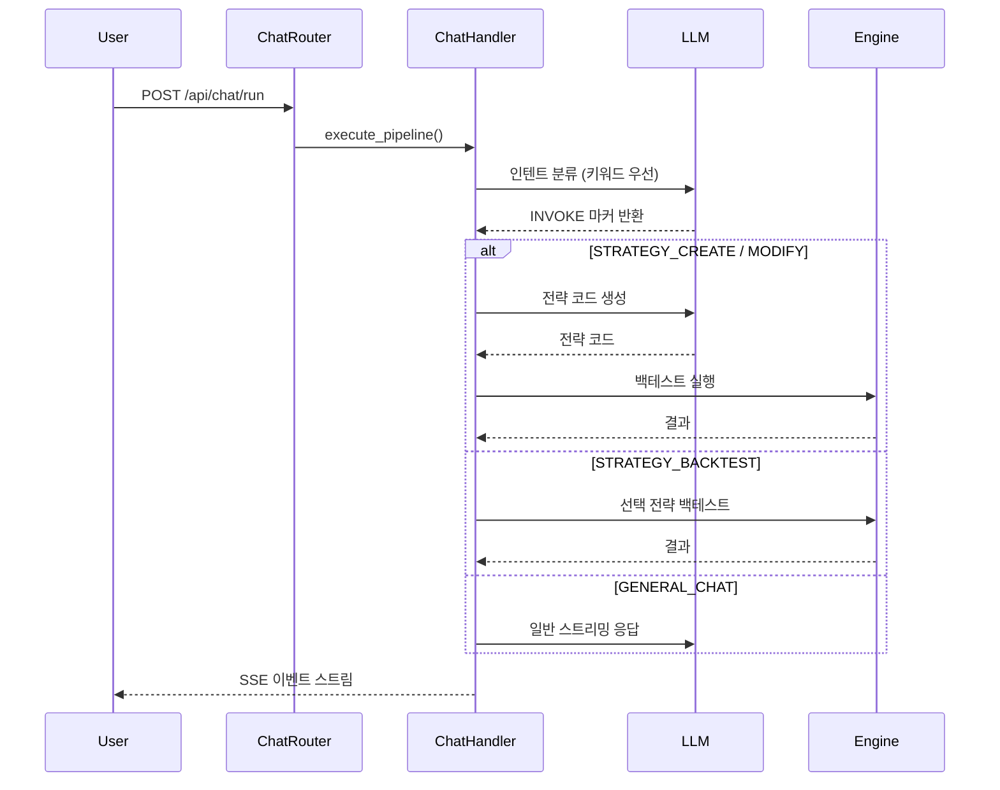

# AI Chat Pipeline

Trinity Chimera 시스템의 채팅 및 전략 발굴 파이프라인 구조를 정리합니다.

---

## 1. 아키텍처 개요

전체 파이프라인은 **Frontend (Next.js)**, **Backend (FastAPI)**, **LLM Client (shared)**, **Supabase DB** 4계층으로 구성됩니다.



---

## 2. API 엔드포인트 목록

| Method | Path | 설명 |
|---|---|---|
| POST | `/api/chat/run` | 채팅 파이프라인 실행 (SSE 스트리밍) |
| GET | `/api/chat/history` | 채팅 내역 조회 (session_id 선택) |
| DELETE | `/api/chat/history` | 세션 채팅 기록 삭제 |
| GET | `/api/chat/sessions` | 채팅 세션 목록 조회 |
| POST | `/api/chat/backtest` | 채팅 중 생성 전략 즉시 백테스트 |
| POST | `/api/chat/deploy` | 생성 전략 라이브러리 배포 |

---

## 3. 인텐트 분류 및 파이프라인 라우팅

`ChatHandler`는 사용자 메시지를 **키워드 기반 규칙(~95%)** 과 **LLM 분류(fallback)** 두 단계로 인텐트를 식별합니다.

### 인텐트 종류

| 인텐트 | INVOKE 마커 | 실행 파이프라인 |
|---|---|---|
| `GENERAL_CHAT` | 없음 | LLM 일반 대화 |
| `STRATEGY_CREATE` | `[INVOKE:CREATE_STRATEGY]` | `pipeline_create.py` |
| `STRATEGY_MODIFY` | `[INVOKE:MODIFY_STRATEGY]` | `pipeline_modify.py` |
| `STRATEGY_BACKTEST` | `[INVOKE:RUN_BACKTEST]` | `pipeline_backtest.py` |
| `STRATEGY_EVOLVE` | `[INVOKE:RUN_EVOLUTION]` | Evolution 루프 연동 |
| `PARAM_OPTIMIZE` | `[INVOKE:PARAM_SEARCH]` | `pipeline_optimize.py` |
| `STRATEGY_WFO` | `[INVOKE:WALK_FORWARD]` | `pipeline_walk_forward.py` |
| `PNL_ANALYSIS` | `[INVOKE:PNL_ANALYSIS]` | `pipeline_pnl.py` |

### 파이프라인 흐름



---

## 4. SSE 이벤트 타입

| type | 의미 |
|---|---|
| `stage` | 파이프라인 단계 변경 (stage, label) |
| `status` | 현재 처리 상태 메시지 |
| `progress` | keepalive 진행 틱 (1초 간격) |
| `content` | LLM 텍스트 청크 |
| `code` | 생성된 전략 코드 블록 |
| `result` | 백테스트 결과 JSON |
| `error` | 오류 메시지 |
| `done` | 파이프라인 완료 |

---

## 5. LLM 공급자 설정

`server/shared/llm/client.py`가 단일 진입점이며, `.env`로 공급자를 전환합니다.

```
LLM_PROVIDER=ollama          # ollama | openai | anthropic
OLLAMA_BASE_URL=http://localhost:11434
OLLAMA_MODEL=qwen3:14b

# Evolution LLM (별도 설정 가능)
ANTHROPIC_BASE_URL=http://localhost:8082
ANTHROPIC_MODEL=qwen/qwen3.5-397b-a17b
ANTHROPIC_API_KEY=sk-...
```

---

## 6. 세션 및 히스토리 저장

- **Supabase** (`server/shared/db/supabase.py`) 에 대화 기록 저장
- `CHAT_HISTORY_LIMIT` (env, 기본 200): DB 조회 상한
- session_id 없이 조회 시 전체 세션 통합 반환
