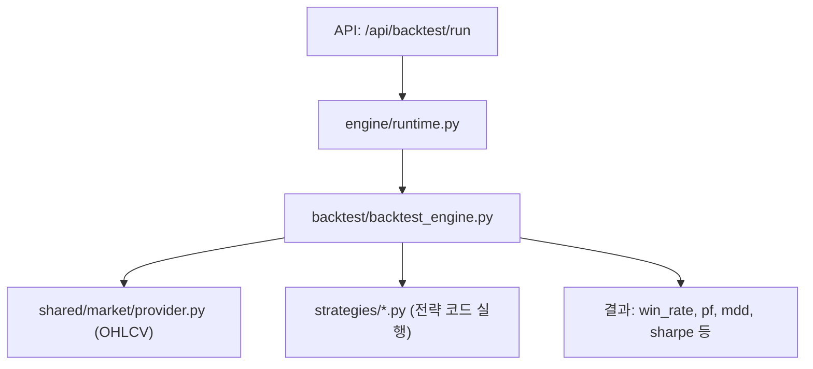

# Backtest System

> **Last Updated**: 2026-05-11

---

## 1. 개요

전략 백테스트 시스템은 `server/modules/engine/` 에서 FastAPI 라우터로 제공되며, 실제 백테스트 연산은 `server/modules/backtest/backtest_engine.py` 에서 수행됩니다.

---

## 2. 엔드포인트

| Method | Path | 설명 |
|---|---|---|
| GET | `/api/backtest/run` | 전략 키 또는 커스텀 코드로 백테스트 실행 |
| GET | `/api/backtest/strategies` | 사용 가능한 전략 목록 반환 |
| GET | `/api/backtest/strategies/{key}/code` | 전략 소스 코드 조회 |
| POST | `/api/backtest/leaderboard` | 여러 전략/타임프레임 성과 비교 |
| POST | `/api/backtest/optimize` | 숫자 파라미터 자동 스캔 + 조합 최적화 |
| GET | `/api/backtest/market/ohlcv` | 차트용 OHLCV 캔들 데이터 |
| POST | `/api/backtest/llm/backtest-analysis` | 결과 LLM 분석 리포트 생성 |

---

## 3. 전략 라이브러리 (`server/strategies/`)

모든 전략 파일은 `generate_signal(df) -> pd.Series` 인터페이스를 구현해야 합니다.

### 현재 등록 전략

| 파일명 | 시장 유형 | 방향 |
|---|---|---|
| `Bull_01_EMA_ADX_RSI_Pullback` | 상승장 | Long |
| `Bull_02_BBWidth_MACD_OBV_Breakout` | 상승장 | Long |
| `Bull_03_RSI_ROC_Momentum_Acceleration_v2` | 상승장 | Long |
| `Bull_04_Conservative_TrendPullback_Long` | 상승장 | Long |
| `Bear_01_Rally_Fade_Short` | 하락장 | Short |
| `Bear_02_Breakdown_Momentum_Short` | 하락장 | Short |
| `Bear_03_Crash_Acceleration_Short` | 하락장 | Short |
| `Bear_04_Conservative_Pullback_Breakdown_Short` | 하락장 | Short |
| `Range_01_RSI_MeanReversion_LongShort` | 횡보장 | Long/Short |
| `Range_02_Bollinger_MeanReversion_LongShort` | 횡보장 | Long/Short |
| `Range_03_SupportResistance_Bounce_LongShort` | 횡보장 | Long/Short |
| `HighVol_01_Lockout` | 고변동 | 진입 차단 |
| `NFI_01_MTF_TrendPullback_LongShort` | 멀티타임프레임 | Long/Short |
| `quant_trend_engine_v3` | 범용 | Long/Short |
| `robust_signal_v2_optimized` | 범용 | Long/Short |
| `deployed_*` | AI 배포 전략 | 가변 |

---

## 4. 최적화 방식

`/api/backtest/optimize` 는 전략 코드에서 숫자 파라미터를 자동 스캔하고 조합을 테스트합니다.

- **method**: `grid` (기본) | `random`
- **objective**: `trinity` | `sharpe` | `return` | `weighted`
- 최대 `max_combos`(기본 50) 개 조합 테스트
- 상위 `top_k` 결과 반환

---

## 5. 백테스트 결과 지표

| 지표 | 설명 |
|---|---|
| `total_return` | 누적 수익률 (%) |
| `max_drawdown` | 최대 낙폭 (%) |
| `sharpe_ratio` | 샤프 비율 |
| `win_rate` | 승률 (%) |
| `profit_factor` | 수익 팩터 |
| `total_trades` | 총 거래 수 |
| `trinity_score` | 종합 점수 (return + sharpe - mdd) |
